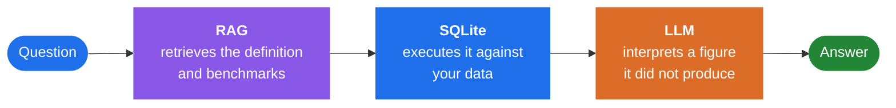

# Lantern V2

**A local AI decision-support system that answers financial questions about your data — with numbers it computed, not numbers it generated.**

---

## The problem

Ask an LLM for your net profit margin and two things can go wrong: it recalls the wrong formula, and it invents a plausible number.

Lantern takes both jobs away from the model.

## The pipeline

> [!IMPORTANT]
> The model never supplies the formula or the number. It only explains the result.

## What it computes

| | | | |
|---|---|---|---|
| Net profit margin | Days sales outstanding | Client concentration | Burn rate |
| Revenue trend | Expense breakdown | Revenue per employee | Client & revenue churn |

## Adapting to a new database

Business schemas never match. An adapter layer maps incoming column names to the required fields by synonym matching and generates SQL views, so the same queries run against a schema they've never seen.

> [!NOTE]
> Before executing, the system shows its interpretation of the question and waits for confirmation. Silent misinterpretation is the expensive failure here — confirmation makes it visible.

## Testing

Validated end to end through manual testing across the three synthetic datasets, with incorrect results traced to the stage that caused them — retrieval, SQL, or generation.

> [!NOTE]
> Automated scoring is the next planned addition. Right now correctness is verified by hand against known values in the synthetic data.

## Data

Ships with three synthetic consulting-firm datasets I generated — **Apex Strategy**, **Meridian Consulting Group**, and **Vertex Advisory Partners** — each with a deliberately different financial profile, so the system runs end to end without proprietary data.

## Running locally

Built to run entirely on local hardware — no cloud services, no external model APIs, no data leaving the machine. Developed and tested against a local Ollama instance.
